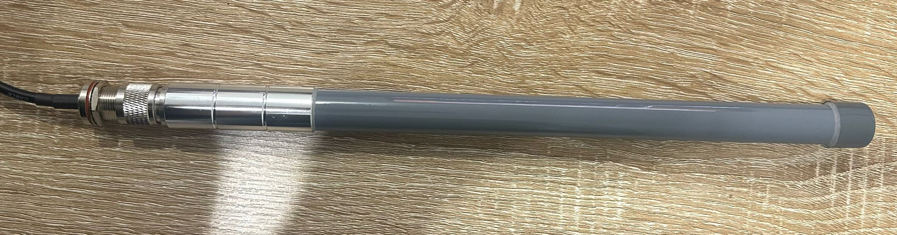
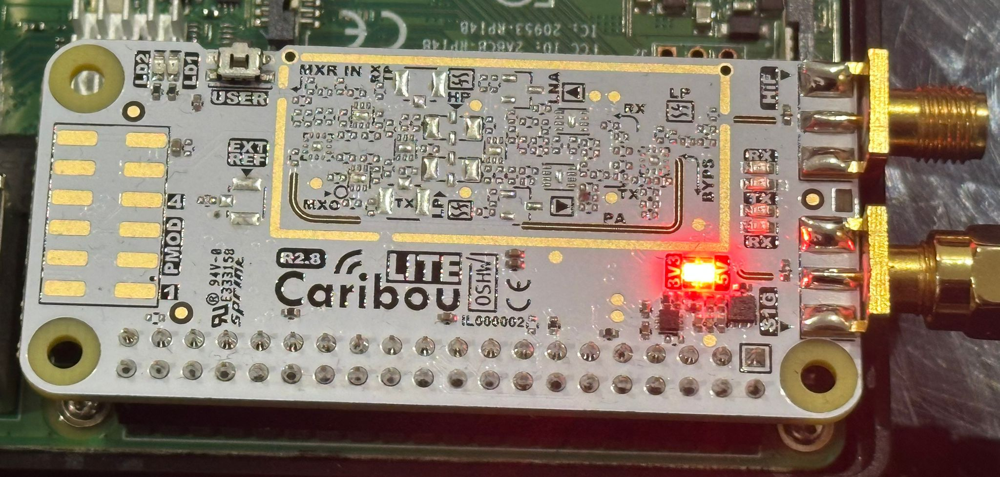
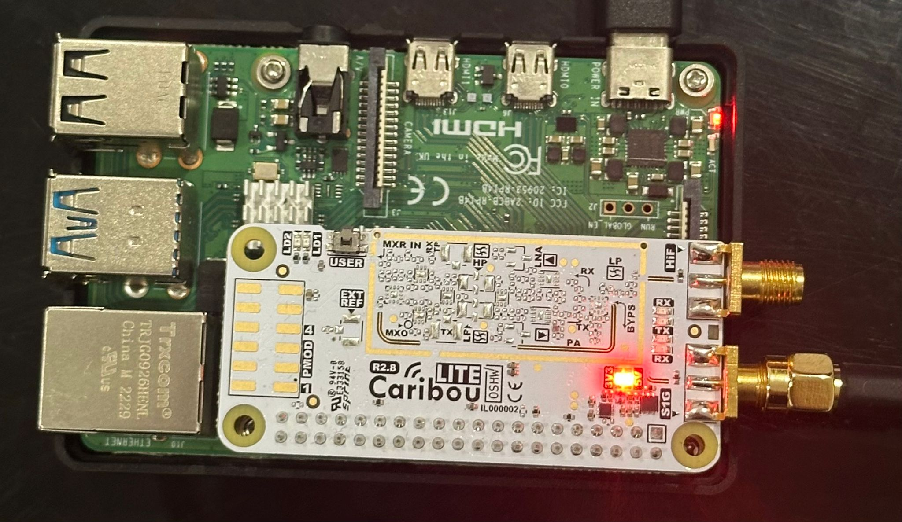
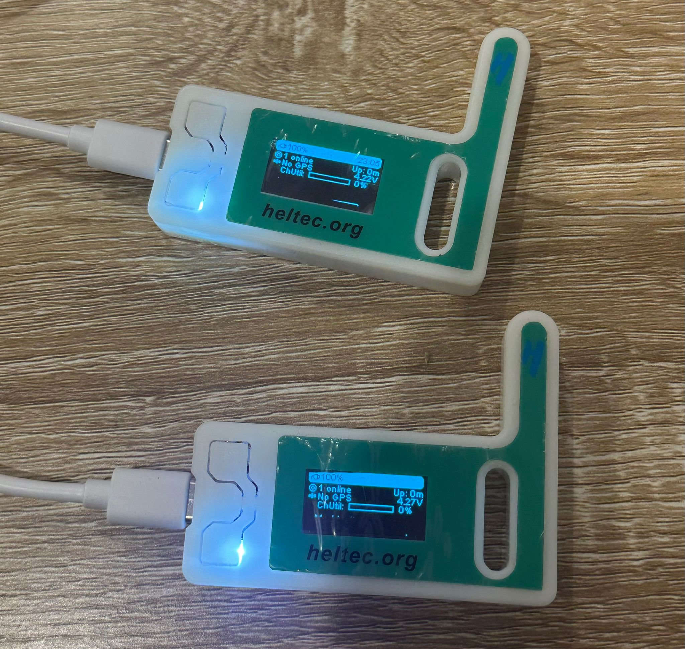
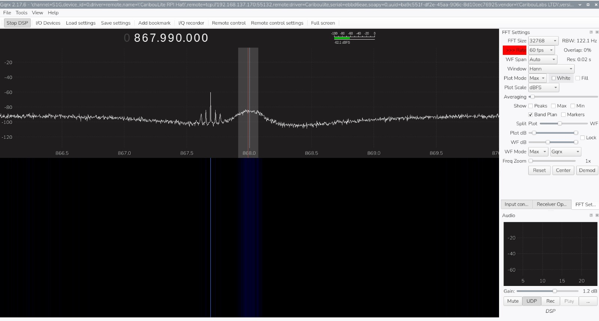
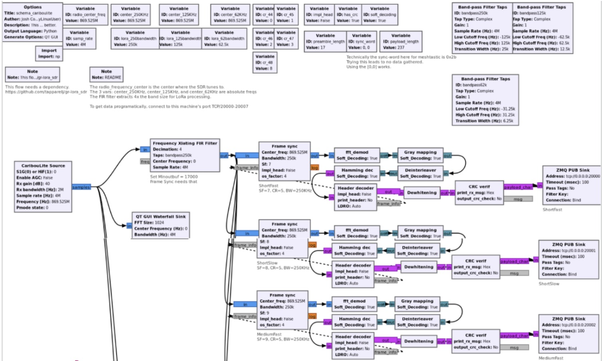
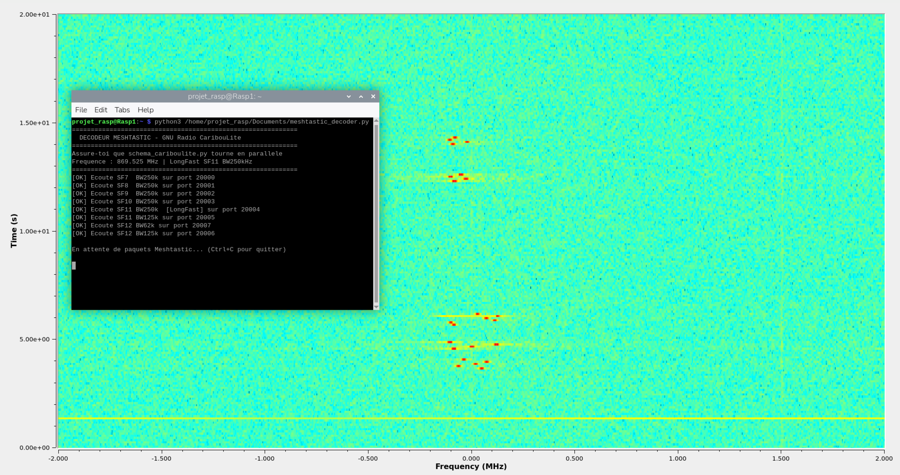
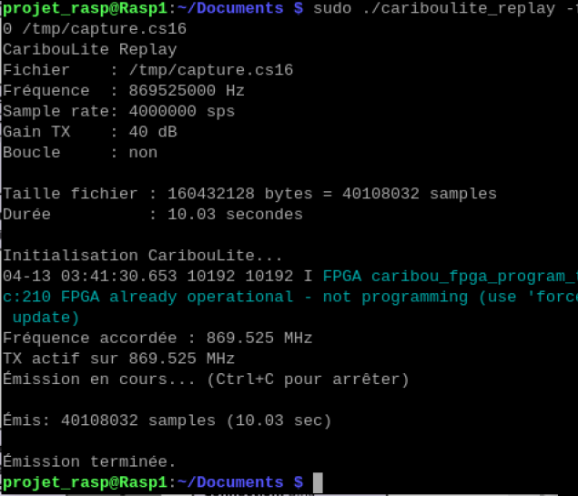

# 📡 Analyse de la Robustesse des Réseaux Meshtastic (LoRa)

> Notre 2eme partie du projet s'articule autour de l'analyse de la robustesse des réseaux maillés Meshtastic (basés sur LoRa). Pour ce faire, nous avons mis en place une station d'interception offensive utilisant une CaribouLite couplée à un Raspberry Pi 4, permettant ainsi une observation spectrale précise et ouvrant la voie à des scénarios de compromission de données sans fil.
---

## 🧰 Matériel utilisé

| Composant | Détails |
|---|---|
| Raspberry Pi 4 | 4 GB RAM |
| CaribouLite RPi HAT | SDR dual-channel, 30 MHz – 6 GHz |
| Carte microSD | 64 Go |
| Antenne | 868 MHz (bande ISM Europe) |
| Cartes Meshtastic | Simulation du trafic légitime |

<p align="center">
  
  &nbsp;&nbsp;
  
  &nbsp;&nbsp;
  
</p>

<p align="center">
  
</p>

---

## 🌐 Contexte technique

### LoRa & LoRaWAN

**LoRa** (Long Range) est une technologie de modulation radio basée sur le **Chirp Spread Spectrum (CSS)**, permettant des communications longue portée (plusieurs km) avec une consommation d'énergie très faible.

- **LoRa** = couche physique (modulation radio)
- **LoRaWAN** = protocole réseau (authentification, chiffrement AES-128, routage)

> Sécurité : Dans un contexte de cybersécurité, bien que le LoRaWAN utilise un chiffrement AES-128, la couche physique reste vulnérable à l'interception spectrale et au brouillage (jamming), ce qui justifie l'utilisation d'outils SDR.


### CaribouLite

La CaribouLite est un HAT pour Raspberry Pi qui le transforme en **SDR (Software Defined Radio)** complet et portable.

- **Dual-Channel** :  Elle possède deux canaux, dont un canal Sub-1GHz optimisé pour les fréquences ISM (868 MHz en Europe), ce qui la rend parfaite pour cibler le LoRa.
- **Full-Duplex** : Contrairement aux simples clés RTL-SDR qui ne font que recevoir, la CaribouLite peut émettre et recevoir simultanément. C'est cette caractéristique qui est indispensable pour réaliser un Man-in-the-Middle (intercepter un signal et en réémettre un autre modifié).
- **Interface SMI** : En utilisant l'interface mémoire secondaire (SMI) du Raspberry Pi, elle offre une bande passante et une réactivité bien supérieures aux solutions USB pour l'analyse de signaux rapides.

> ❌ Le Raspberry Pi 5 **n'est pas compatible** avec la CaribouLite (interface SMI différente).

### Écosystème Meshtastic

Meshtastic est un projet open-source qui crée des **réseaux maillés décentralisés** sur LoRa. Chaque nœud agit comme répéteur : les messages sautent de nœud en nœud jusqu'à destination.

Utilisé par : randonneurs, secouristes, contextes tactiques sans réseau cellulaire.  

Vecteur d'attaque : Pour notre projet, les cartes Meshtastic simulent le trafic légitime que nous cherchons à sniffer ou à perturber via une attaque de type Man-in-the-Middle.
---

## ⚙️ Installation & Configuration

### Étape 1 — Préparation

Avant tout, ajouter dans `/boot/firmware/config.txt` :

```bash
dtparam=i2c_vc=on
```

> Évite une erreur lors de la vérification de l'environnement à la fin du script d'installation.

### Étape 2 — Installation des drivers CaribouLite

```bash
git clone https://github.com/cariboulabs/cariboulite.git
cd cariboulite
sudo bash install.sh
```

### Étape 3 — Patch kernel 6.10+ (compatibilité Bookworm)

Le Raspberry Pi 4 sous Bookworm utilise le **kernel 6.12**. Le driver CaribouLite ne compile pas nativement sur les kernels ≥ 6.4 à cause de deux changements d'API Linux :

| Kernel | Changement |
|---|---|
| 6.4+ | `class_create()` ne prend plus le paramètre `owner` |
| 6.11+ | `platform_driver.remove()` retourne `void` au lieu de `int` |

**Solution** : appliquer le patch de compatibilité disponible ici :  
👉 [CaribouLite-Kernel-Fixes.md](https://github.com/ResistanceIsUseless/cariboulite/blob/main/CaribouLite-Kernel-Fixes.md)

Référence complète : [jeffgeerling.com — CaribouLite SDR HAT on Raspberry Pi](https://www.jeffgeerling.com/blog/2025/cariboulite-sdr-hat-sdr-on-raspberry-pi/)

### Étape 4 — Vérification de la détection

```bash
sudo SoapySDRUtil --find
```

Résultat attendu : deux périphériques détectés — **HiF** et **S1G** (sub-1 GHz).

```bash
sudo ./cariboulite_test_app
```

### Étape 5 — Installation et configuration de GQRX

```bash
sudo apt-get update
sudo apt-get install -y gqrx-sdr
gqrx
```

Dans l'interface : sélectionner le device **CaribouLite S1G** et régler la fréquence sur **868 MHz**.

#### Paramètres FFT recommandés

| Paramètre | Valeur |
|---|---|
| FFT Size | 32768 |
| Rate | 250 fps |
| WF Span | Auto |
| Window | Hann |
| Plot Mode | Max |
| Plot Scale | dBFS |
| WF Mode | Max / Gqrx |
| Band Plan | activé |

#### Résultat obtenu dans GQRX

- Fréquence centrale : **867.990 MHz**
- Bruit de fond : **-90 à -100 dBFS**
- Bursts LoRa/Meshtastic : pics distincts autour de **867.5–868.0 MHz**, montant à **~-50 dBFS**
- Waterfall : émissions visibles sous forme de **traces verticales colorées**

<p align="center">
  
</p>

---

## 📻 Pipeline GNU Radio — Capture & Décodage

Qu'est-ce que GNU Radio ?

GNU Radio est un logiciel qui permet de traiter les signaux radio. On peut le comparer à des "briques" de Lego que l'on branche ensemble : chaque bloc fait une tâche simple (capturer, nettoyer, afficher), et ensemble ils traitent les signaux radio. Pour notre projet, nous avons construit un système complet qui :
- Capture les signaux LoRa (le radio de Meshtastic)
- Nettoie ces signaux
- Comprend les messages à l'intérieur
- Montre ce qui se passe en temps réel
- Enregistre tout pour analyser plus tard

 Voici le **[Diagramme de notre système](LoRa_Meshtastic/schema_cariboulite.grc)**:


<p align="center">
  
</p>

```
[CaribouLite] → [Filtre] → [Affichage waterfall] → [Décodeurs LoRa x3] → [Fichier capture]
```

### 1. Réception du signal (CaribouLite)

| Paramètre | Valeur |
|---|---|
| Fréquence | 869.525 MHz |
| Taux d'échantillonnage | 4 MSps |
| Gain | 40 dB |

On prend 4 millions de "photos" du signal chaque seconde, ce qui nous permet de bien voir les détails.

### 2. Nettoyage du signal (Filtrage)

On applique un filtre pour nettoyer le signal :

- On garde seulement la radio que nous cherchons (869.525 MHz)

- On élimine le bruit et les autres radios autour
- On réduit la quantité de données à traiter (on divise par 4)

C'est comme si on zoomait sur une partie du visible et qu'on ignorait le reste.


### 3. Voir ce qui se passe en direct (Affichage)

On trace un graphique qui montre les signaux radio (comme une caméra thermique) :
- L'axe horizontal : les différentes fréquences
- L'axe vertical : le temps qui passe
- Les couleurs : les signaux plus ou moins forts


Les signaux LoRa aparaissent sous forme de traits jaunes/oranges qui descendent.

<p align="center">
  
</p>

### 4. Décoder les messages:

C'est la partie la plus importante : transformer le signal radio brut en paquets structurés avec leurs en-têtes et métadonnées.

On ne peut pas lire le contenu réel des messages (il est chiffré), mais on récupère des informations précieuses :
- Qui envoie le message (adresse source)
- Qui le reçoit (adresse destination)
- Quand il a été envoyé
- Combien de fois il a été relayé
- Quel type de message c'est

Le signal LoRa est compliqué, donc on utilise 3 décodeurs différents en même temps pour voir lequel fonctionne le mieux. C'est comme essayer 3 clés différentes pour ouvrir une porte.

Le Spread Factor (SF) contrôle comment le message est étalé sur la fréquence. Plus le SF est grand, plus le message occupe de temps mais plus il peut être reçu loin. Meshtastic choisit automatiquement le SF selon les conditions. On en teste 3 pour être sûr d'en attraper au moins un.

| Méthode | Spread Factor | Portée estimée | Caractéristiques |
|---|---|---|---|
| ShortFast | SF=7 | ~7 km | Rapide, courte portée |
| MediumFast | SF=8 | ~15 km | Équilibre portée/débit |
| LongSlow | SF=9 | ~30 km | Lent, longue portée |

**Étapes du décodage dans chaque méthode :**
1. Synchronisation (repérage du début du message)
2. Filtrage de la bande utile
3. Conversion des ondes radio en symboles numériques
4. Correction des erreurs de transmission
5. Suppression du masquage des données (dewhitening)
6. Vérification d'intégrité (CRC)
7. Envoi pour affichage

### 5. Enregistrement

On enregistre tous les signaux qu'on reçoit dans un fichier. Ça nous permet de :
- Rejouer les signaux plus tard
- Essayer de nouvelles façons de les décoder
- Montrer exactement ce qu'on a trouvé


```bash
sudo cariboulite_util -c 0 -f 869525000 -n 40000000 /tmp/capture.cs16
```

---

## 🎯 Replay Attack — Rejouer les signaux capturés

Après avoir enregistré les signaux réels, on peut les rejouer avec la CaribouLite. C'est comme appuyer sur "play" sur un enregistrement radio.


Compilation du **[replayer](LoRa_Meshtastic/cariboulite_replay.c)** :

```bash
gcc /home/projet_rasp/Documents/cariboulite_replay.c -o cariboulite_replay \
    -I/usr/local/include \
    -L/usr/local/lib \
    -Wl,-rpath,/usr/local/lib \
    -lcariboulite -lpthread -lm
```

Rejeu du signal capturé :

```bash
sudo ./cariboulite_replay -f 869525000 -r 4000000 /tmp/capture.cs16
```
On obtient:

<p align="center">
  
</p>

---

## 🚀 Commandes de lancement

**Terminal 1 — Pipeline GNU Radio :**
```bash
sudo python3 /home/projet_rasp/Documents/schema_cariboulite.py 2>&1 | tee /tmp/gnuradio_log.txt
```

**Terminal 2 — Décodeur Meshtastic :**
```bash
sudo python3 /home/projet_rasp/Documents/meshtastic_decoder.py
```

---

## 🔍 Résultats & Analyse

Qu'est-ce que ça signifie pour Meshtastic ? 

Ces résultats montrent que :

1. Les signaux LoRa sont pas protégés au niveau radio
Avec la CaribouLite, n'importe qui peut recevoir les messages de Meshtastic. Il n'y a rien qui empêche quelqu'un d'écouter.
Ce que ça veut dire : Si quelqu'un a une CaribouLite à côté, il peut voir tous les messages qui passent dans l'air. C'est comme avoir un téléphone qui reçoit les appels à la place de l'utilisateur.
2. On peut enregistrer et rejouer les messages
On a réussi à enregistrer un signal et à le renvoyer à l'identique. Quelqu'un de malveillant pourrait :
Enregistrer un message "appel d'urgence"
Le rejouer 10 fois pour que le réseau le reçoive plusieurs fois
Créer la confusion
Ce type d'attaque s'appelle "replay attack" : on prend un vrai message et on le renvoie.
3. Le réseau parle souvent
On a enregistré 10 secondes et on a déjà plein de messages. Meshtastic est très actif. Ça veut dire qu'un attaquant a beaucoup de chances de trouver quelque chose d'intéressant.
4. Personne ne sait qu'on écoute
Meshtastic ne détecte pas la présence de notre CaribouLite. C'est transparent. L'attaque passive peut continuer indéfiniment sans être détectée.

### Ce qu'on a pu faire

✅ Recevoir les messages : La CaribouLite reçoit tous les messages LoRa sans être détectée.

✅ Extraction des métadonnées : Adresses source/destination, timestamps, nombre de relais, type de message.

✅ Capture de trafic actif : 10 secondes suffisent à capturer de nombreux paquets.

✅ Replay Attack : Signal enregistré puis renvoyé à l'identique sur le réseau.

### Ce qu'on n'a pas pu faire

❌ Lire le contenu des messages : les vrais messages sont chiffrés (verrouillés), donc on les voit passer mais on ne peut pas lire ce qu'il y a dedans. C'est un bon point de sécurité.

❌ Faire des attaques plus méchantes :  On a montré qu'on pouvait écouter et rejouer. Mais on pourrait aussi essayer de brouiller le réseau ou d'envoyer de faux messages. On l'a pas fait dans ce projet.

❌ Tester beaucoup plus longtemps : On a juste enregistré 10 secondes. En vérifié pendant des heures, on pourrait voir plein d'autres choses.


### Implications sécurité

1. **Aucune protection au niveau radio** — n'importe qui avec une CaribouLite peut intercepter le trafic LoRa
2. **Replay attack possible** — un message légitime (ex: appel d'urgence) peut être rejoué indéfiniment
3. **Réseau très verbeux** — Meshtastic émet fréquemment, augmentant la surface d'attaque
4. **Indétectable** — l'écoute passive ne laisse aucune trace sur le réseau

---

## 🛠️ Problèmes rencontrés & Solutions

| Problème | Solution |
|---|---|
| Driver non chargé | Ajouter `dtparam=i2c_vc=on` dans `/boot/firmware/config.txt` |
| Kernel 6.12 incompatible | Appliquer le [patch de compatibilité](https://github.com/ResistanceIsUseless/cariboulite/blob/main/CaribouLite-Kernel-Fixes.md) |
| GQRX freeze / lent | Réduire la FFT Size dans les paramètres |
| CaribouLite non détectée | Redémarrer après installation des drivers |

---

## 📚 Références

- [jeffgeerling.com — CaribouLite SDR HAT on Raspberry Pi](https://www.jeffgeerling.com/blog/2025/cariboulite-sdr-hat-sdr-on-raspberry-pi/)
- [github.com/cariboulabs/cariboulite](https://github.com/cariboulabs/cariboulite)
- [Patch kernel — ResistanceIsUseless](https://github.com/ResistanceIsUseless/cariboulite/blob/main/CaribouLite-Kernel-Fixes.md)
